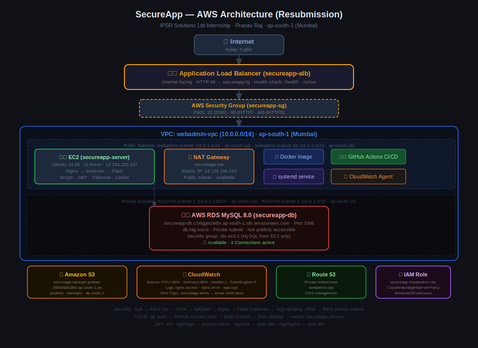

# Architecture — SecureApp (Task Manager)

**Capstone Project · IPSR Solutions Ltd Internship**
**Student:** Pranav Raj | **Stack:** Flask · AWS · Docker · GitHub Actions

---

## Overview

SecureApp is a cloud-native task management application built using Flask (Python), deployed on AWS EC2 with a MySQL database on RDS, fronted by an Application Load Balancer, monitored via CloudWatch, backed up to S3, and delivered through an automated CI/CD pipeline using GitHub Actions.

---

## Live URLs
- **ALB:** http://secureapp-alb-2065264995.ap-south-1.elb.amazonaws.com
- **Direct:** https://13.234.225.107
- **GitHub:** https://github.com/Pranavraj5151/cloud-secure-web-app

---

## Architecture Diagram



---

## System Layers

### 1. Internet → Application Load Balancer
All public traffic enters through the **ALB** (`secureapp-alb`), which is Internet-facing and deployed across two availability zones (ap-south-1a and ap-south-1b). The ALB forwards HTTP:80 traffic to the target group `secureapp-tg` and performs health checks on `/health` every 30 seconds.

### 2. Network Layer — AWS VPC (webadmin-vpc, 10.0.0.0/16)
| Subnet | CIDR | AZ | Type |
|--------|------|----|------|
| webadmin-subnet | 10.0.1.0/24 | ap-south-1a | Public (EC2 + ALB) |
| webadmin-subnet-1b | 10.0.2.0/24 | ap-south-1b | Public (ALB) |
| RDS-Pvt-subnet-1 | 10.0.0.128/25 | ap-south-1a | Private (RDS) |
| RDS-Pvt-subnet-2 | 10.0.3.0/25 | ap-south-1b | Private (RDS) |

A **NAT Gateway** (`secureapp-nat`, Elastic IP: 13.126.106.215) is deployed in the public subnet to allow private subnet resources to reach the internet.

### 3. EC2 Instance — Ubuntu 24.04 (t2.micro)
The Flask application runs on EC2 behind Nginx and Gunicorn. Security is enforced at the host level via UFW firewall and fail2ban brute-force protection.

### 4. Application Layer — Flask
**Security features:**

| Feature | Implementation |
|---------|---------------|
| Password Hashing | bcrypt |
| JWT Authentication | Flask-JWT-Extended (/api/login, /api/me, /api/tasks) |
| Rate Limiting | Flask-Limiter |
| SQL Injection Prevention | SQLAlchemy ORM |
| XSS Protection | Jinja2 auto-escaping |
| Security Headers | Flask-Talisman + Nginx |
| RBAC | Admin and User roles |
| Failed Login Tracking | Python logging → CloudWatch |

### 5. Database — AWS RDS MySQL 8.0
Private subnet, not publicly accessible. Only EC2 can connect via port 3306.

| Setting | Value |
|---------|-------|
| Endpoint | secureapp-db.c34iggw2e8lx.ap-south-1.rds.amazonaws.com |
| Instance | db.t4g.micro |
| Public Access | Disabled |

### 6. Storage — Amazon S3
| Purpose | Path |
|---------|------|
| Profile pictures | profiles/ |
| MySQL backups | backups/ |

### 7. Monitoring — CloudWatch

**Log Groups:**
- `secureapp-nginx-access`
- `secureapp-nginx-error`
- `secureapp-app-logs` (contains FAILED_LOGIN_ATTEMPT events)

**Alarms:**
| Alarm | Metric | Threshold |
|-------|--------|-----------|
| SecureApp-High-CPU | CPUUtilization | > 80% |
| SecureApp-High-Memory | mem_used_percent | > 80% |
| SecureApp-Health-Check | HealthyHostCount | < 1 |
| SecureApp-Failed-Logins | FailedLoginAttempts | > 5 in 5 min |

All alarms notify via SNS email topic `secureapp-alerts`.

---

## CI/CD Pipeline

```
Developer → git push to main
                │
                ├── TEST job — pip install + Bandit security scan
                ├── BUILD job — Docker image build verification
                └── DEPLOY job — SSH to EC2 → git pull → restart secureapp + nginx
```

---

## Security Layers Summary

```
Internet
    │
[ALB] ← Layer 0: Load balancer, health checks
    │
[AWS Security Group] ← Layer 1: Network firewall
    │
[UFW] ← Layer 2: Host firewall
    │
[Nginx + fail2ban] ← Layer 3: Reverse proxy + brute force protection
    │
[Gunicorn] ← WSGI server
    │
[Flask + Talisman + Limiter] ← Layer 4: App security
    │
[RDS MySQL via SQLAlchemy ORM] ← Layer 5: Private DB, parameterized queries
```

---

*SecureApp — Internship Capstone · IPSR Solutions Ltd · Pranav Raj · 2026*
